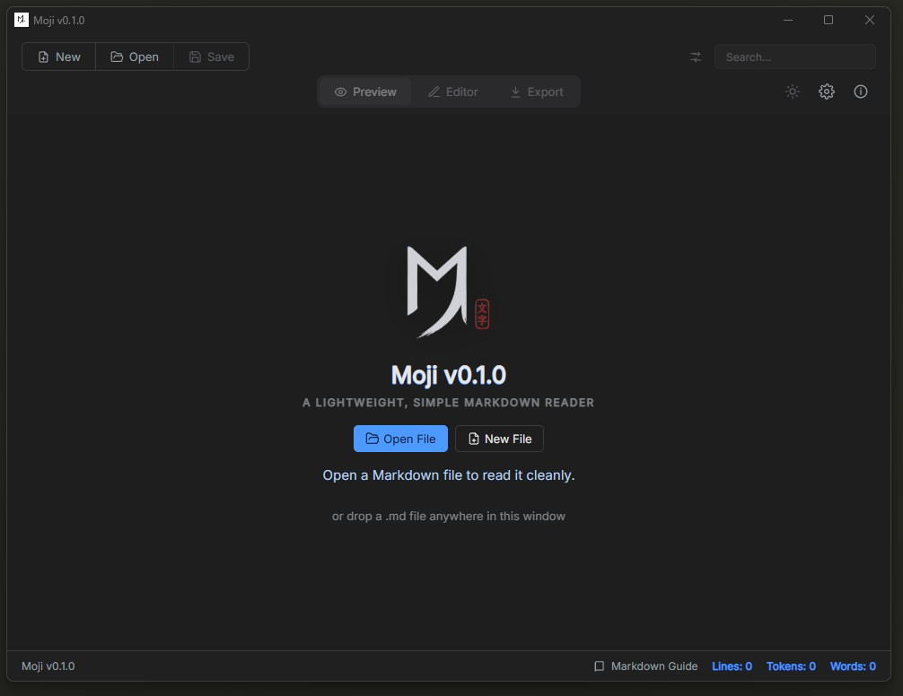
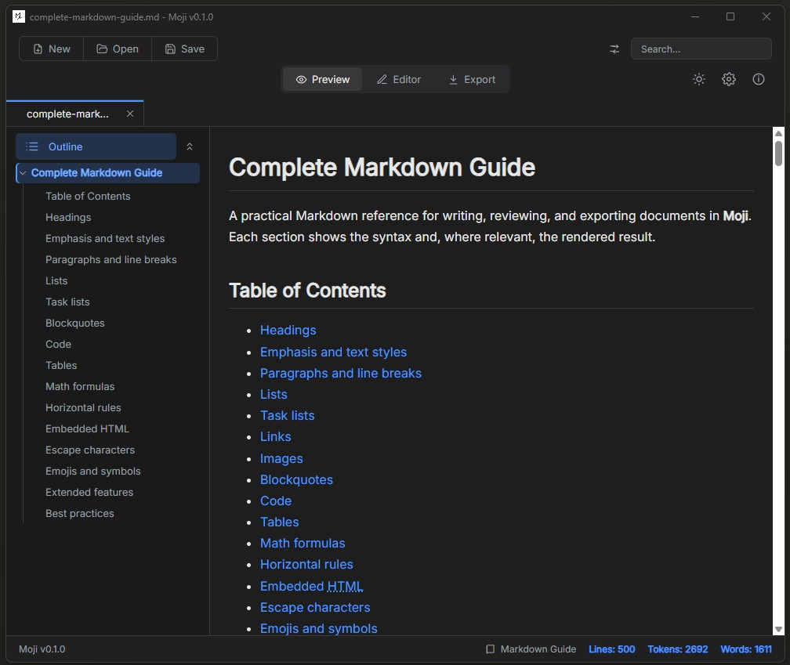
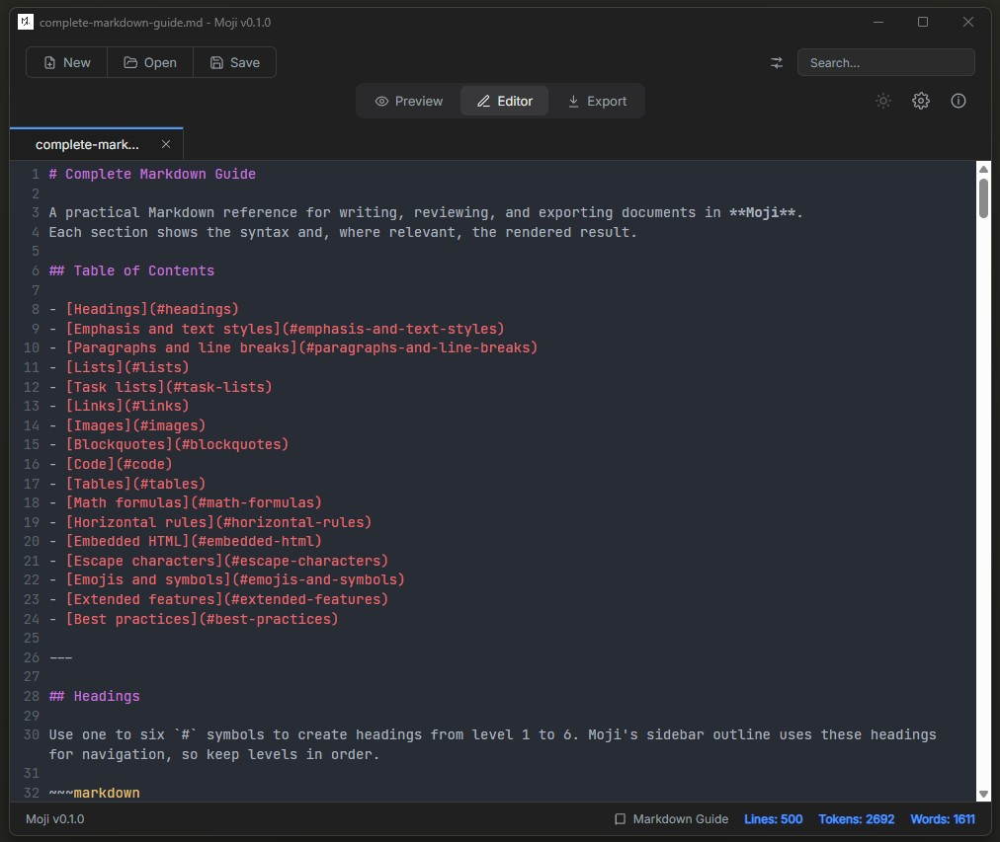
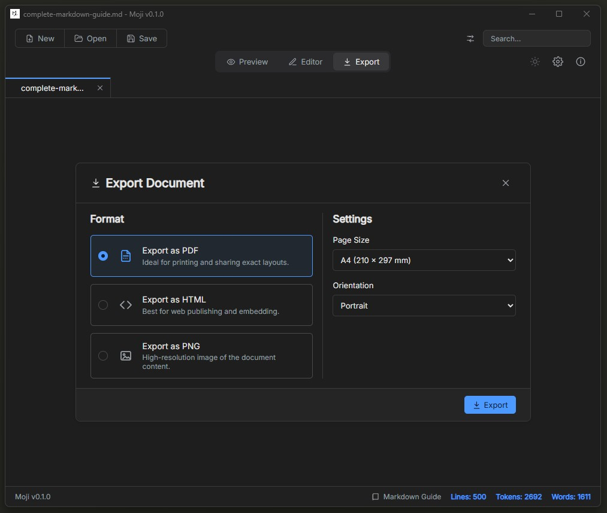

<p align="center">
  
</p>

<h1 align="center">Moji</h1>

<p align="center">A lightweight, clean desktop app for opening, reading, editing, and exporting Markdown files.</p>

<p align="center">Built with Electron, React, TypeScript, and electron-vite.</p>

## Screenshots

<p align="center">
  
  
</p>

<p align="center">
  
  
</p>

## Name

**Moji (文字)** literally means "letter", "character", or "writing" in Japanese. It fits an app focused on opening, editing, and exporting Markdown with as little friction as possible.

## Features

- **Open Markdown files**: supports `.md` and `.markdown` through file dialog, drag and drop, CLI/file association entry points, and single-instance forwarding.
- **Multi-document workspace**: horizontal tabs, dirty markers, close buttons, duplicate-file detection, and unsaved-change confirmation.
- **Preview mode**: sanitized Markdown rendering with heading anchors, outline navigation, tables, task lists, footnotes, definition lists, subscript/superscript, highlight/insert marks, emoji shortcodes, LaTeX math via KaTeX (`$…$` and `$$…$$`), linkify, typographer, and syntax-highlighted code.
- **Outline navigation**: collapsible heading tree with scroll-spy that highlights the heading nearest the viewport top, plus smooth scroll-to-heading on click and anchor links.
- **Search and replace**: top-bar search highlights matches in preview/editor, shows occurrence count, jumps to the next match, and replaces one match or all matches in the active document.
- **Editor mode**: CodeMirror 6 Markdown editor with line numbers, history, wrapping, and save/save as flows.
- **Export mode**: export the active document as HTML, PDF, or PNG. PDF supports A4, Letter, Legal, portrait, and landscape.
- **Settings view**: centered in-workspace panel for language and preview typography controls.
- **About view**: in-workspace panel showing app name, version (from `package.json`), author, repository link, and the story behind the name.
- **Markdown guide**: bundled reference document (`samples/guia-markdown-completo.md`) opened from the status bar.
- **Markdown themes**: dark/light toggle for rendered Markdown and exported output. App chrome remains dark; exports always use the light theme.
- **Internationalization**: English, Portuguese (Brazil), Spanish, Japanese, Chinese, and Russian. Initial language follows the OS when possible and user choice is persisted.
- **Security**: sandboxed renderer, context isolation, `nodeIntegration: false`, DOMPurify sanitization, and external links opened in the OS browser.

## Requirements

- Node.js 18+ (developed on Node 22)
- npm

## Development

```bash
npm install
npm run dev
npm run typecheck
npm run build
```

Useful scripts:

- `npm run dev`: launch Electron with hot reload.
- `npm run typecheck`: run TypeScript checks without emitting files.
- `npm run build`: build main, preload, and renderer into `out/`.
- `npm run preview`: run the built app preview.

## Packaging

```bash
npm run dist
npm run dist:win
npm run dist:linux
```

Artifacts are written to `release/`.

Current packaging targets:

- Windows: NSIS installer, x64.
- Linux: AppImage and deb.

File associations for `.md` and `.markdown` are declared in `electron-builder.yml`.

## Project Structure

```text
electron/
  main.ts        Window lifecycle, file opening, single-instance flow, close guard, IPC registration
  preload.ts     Safe renderer API exposed through contextBridge
  shared.ts      Shared IPC names, settings, export types, languages, supported extensions
  settings.ts    User settings persistence
  export.ts      HTML/PDF/PNG export implementation

src/
  App.tsx        Renderer state, document actions, close guard wiring, mode switching
  components/    Top bar, tabs, sidebar, outline tree, preview, editor, export/settings/about dialogs, confirm dialog, welcome view
  lib/           Markdown rendering, outline extraction, preview scroll-spy, export HTML, hooks
  locales/       en, pt-BR, es, ja, zh, ru translation files
  styles/        Theme tokens, app shell CSS, Markdown preview CSS

samples/         Bundled Markdown documents (full Markdown guide)
```

## Documentation

- `.ai-framework/RULES.md`: project rules for AI-assisted changes.
- `.ai-framework/DESIGN.md`: visual system, tokens, layout, and component rules.
- `openspec/specs/`: current behavior specs.

## License

MIT © Alex Ishida
