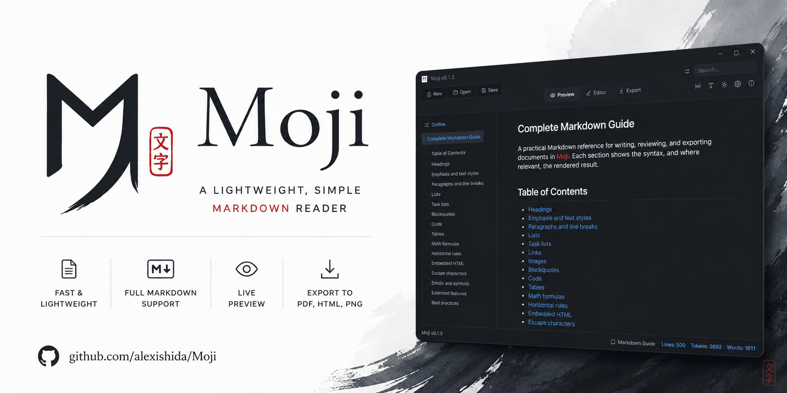
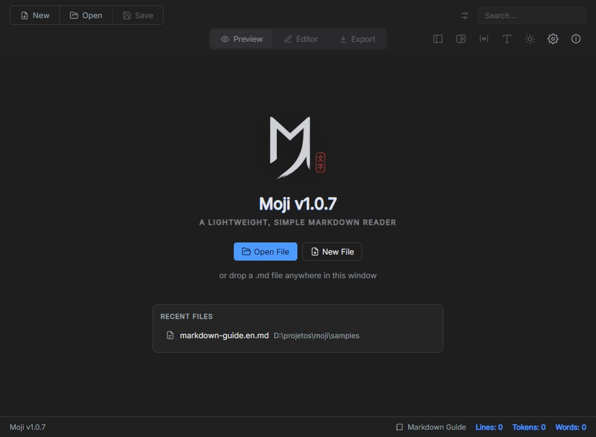
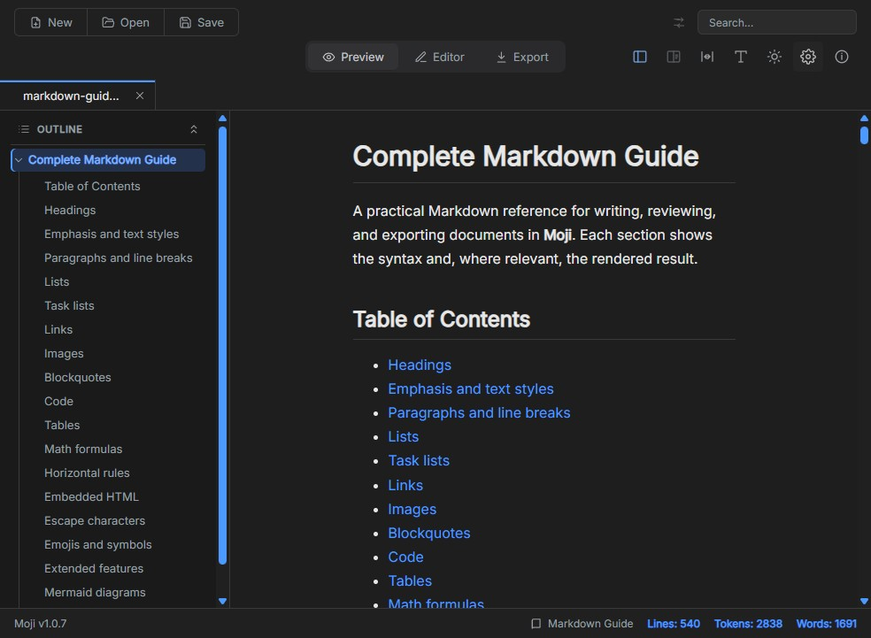
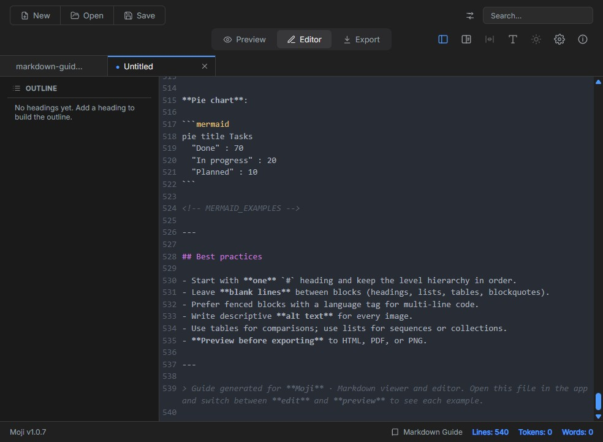
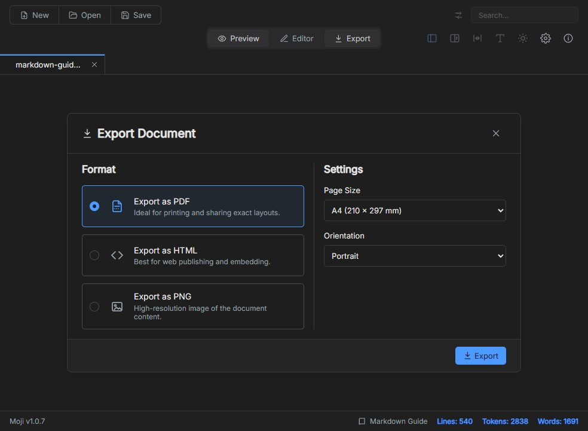
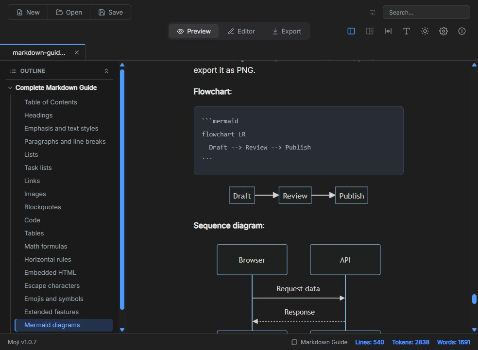
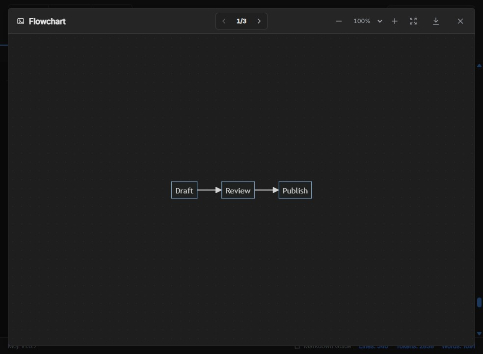

<p align="center">
  
</p>

<h1 align="center">Moji</h1>

<p align="center">A lightweight, clean desktop app for opening, reading, editing, and exporting Markdown files.</p>

<p align="center">Built with Electron, React, TypeScript, and electron-vite.</p>

<p align="center"><strong>Current version:</strong> v1.0.6</p>

<p align="center">
  
</p>

<p align="center">
  <strong>Download:</strong>
  <a href="https://github.com/alexishida/Moji/releases/download/v1.0.6/Moji.Setup.1.0.6.exe">Windows</a>
  ·
  <a href="https://github.com/alexishida/Moji/releases/download/v1.0.6/Moji-1.0.6-universal.dmg">macOS (DMG)</a>
  ·
  <a href="https://github.com/alexishida/Moji/releases/download/v1.0.6/Moji-1.0.6-x86_64.AppImage">Linux (AppImage)</a>
  ·
  <a href="https://github.com/alexishida/Moji/releases/download/v1.0.6/Moji-1.0.6-amd64.deb">Linux (DEB)</a>
</p>


## Name

**Moji (文字)** literally means "letter", "character", or "writing" in Japanese. Short and easy to remember, it evokes characters and writing. The name fits its purpose: opening, editing, previewing, and exporting Markdown smoothly—without distractions.

## Features

- **Open Markdown files**: supports `.md` and `.markdown` through file dialog, drag and drop, CLI/file association entry points, and single-instance forwarding.
- **Multi-document workspace**: horizontal tabs, dirty markers, close buttons, duplicate-file detection, and unsaved-change confirmation with clear action icons.
- **Tab management**: close other tabs, tabs to the right, saved tabs, or all tabs from the document tab menu.
- **Preview mode**: sanitized Markdown rendering with heading anchors, outline navigation, tables, task lists, footnotes, definition lists, subscript/superscript, highlight/insert marks, emoji shortcodes, LaTeX math via KaTeX (`$…$` and `$$…$$`), linkify, typographer, syntax-highlighted code, and copy buttons for code blocks.
- **Graphics and Mermaid diagrams**: every valid fenced `mermaid` block supported by bundled Mermaid renders as a responsive diagram, including flowcharts, sequence, Gantt, class, ER, state, and journey diagrams. Click any rendered SVG or Markdown image to inspect it in a modal with zoom, drag navigation, a minimap, and individual PNG export; malformed Mermaid blocks remain readable code blocks.
- **Outline navigation**: collapsible heading tree available in Preview and Editor modes. Preview uses scroll-spy; clicking any heading scrolls preview or moves editor cursor to its Markdown source.
- **Search and replace**: top-bar search finds visible Markdown text even across inline formatting, distinguishes the active match, and shows the active/total occurrence count. Preview offers previous/next navigation; Editor separates navigation from replace-one/replace-all controls.
- **Editor mode**: CodeMirror 6 Markdown editor with line numbers, history, wrapping, localized untitled document names, Markdown formatting shortcuts, and save/save as flows.
- **Live preview**: toggle a resizable split view from the top bar (or `Ctrl`+`\`) to keep the rendered preview beside the source editor. The preview follows the part of the document being edited, and the pane ratio is remembered. The toggle is disabled when the workspace is too narrow for two readable panes.
- **Untitled document recovery**: documents without a filesystem path are saved as internal recovery drafts and reopened after restarting Moji. Saving as a real file or closing the tab removes the recovery draft.
- **Export mode**: export the active document as HTML, PDF, or PNG. PDF supports A4, Letter, Legal, portrait, and landscape; long code lines wrap in PDF and PNG exports.
- **Diagram exports**: rendered Mermaid diagrams are embedded as self-contained SVG in HTML, PDF, and PNG exports.
- **Settings view**: centered in-workspace panel for language, untitled-document recovery, preview typography, reading width, and a localized shortcut reference.
- **About view**: in-workspace panel showing app name, version (from `package.json`), author, repository link, and the story behind the name.
- **Markdown guide**: bundled localized reference documents (`samples/markdown-guide.<locale>.md`) opened from the status bar.
- **Recent files**: Welcome screen shows recently opened Markdown files and lets you reopen or remove entries.
- **Remembered app state**: window size/position, recent files, last used folder, language, preview typography, reading width, Markdown preview theme, live preview split and pane ratio, and untitled-document recovery preference are persisted in user settings.
- **Update checks**: installed Windows NSIS and Linux AppImage builds check GitHub Releases and link to the release page when a newer version is available, so you can choose the correct artifact.
- **Markdown themes**: dark/light toggle for rendered Markdown. App chrome remains dark; exports always use the light theme.
- **Internationalization**: English, Portuguese (Brazil), Spanish, Japanese, Chinese, and Russian. Initial language follows the OS when possible and user choice is persisted.
- **Security**: sandboxed renderer, context isolation, `nodeIntegration: false`, DOMPurify sanitization, and external links opened in the OS browser.
- **Keyboard shortcuts**: common file, search, replace, tab, preview, export, fullscreen, and font-size actions; Settings lists every available shortcut.

## Screenshots

<p align="center">
  
  
</p>

<p align="center">
  
  
</p>

<p align="center">
  
  
</p>


## Installation

Windows and Linux install from the downloads above with no extra steps.

### macOS

macOS refuses to open Moji the first time, saying it is damaged or that Apple cannot check it for malicious software. **The app is fine.** Signing an app requires a paid Apple Developer account, which Moji does not have yet, so macOS treats it as coming from an unidentified developer.

1. Drag **Moji** from the DMG into your **Applications** folder.
2. Double-click it. macOS blocks it. Dismiss the dialog.
3. Open **System Settings > Privacy & Security**, scroll to the **Security** section, and click **Open Anyway** next to the message about Moji.
4. Confirm. macOS remembers the choice, so this is a one-time step per version.

> Control-clicking the app and choosing *Open* **no longer works** on macOS 15 (Sequoia) and later: [Apple removed that override](https://developer.apple.com/news/?id=saqachfa). System Settings is the only route through the interface.

If you prefer the terminal, clearing the quarantine flag skips the prompts entirely:

```bash
xattr -dr com.apple.quarantine /Applications/Moji.app
```

Update from GitHub Releases by downloading a new DMG. Signing and notarizing future macOS builds removes Gatekeeper warnings.

## Requirements

- Node.js `^20.19.0 || >=22.12.0` (required by Vite 7 and electron-vite 5; packaging also needs `require()` of ES modules, unflagged since Node 22.12)
- npm

## Development

```bash
npm install
npm run dev
npm run typecheck
npm test
npm run build
```

Useful scripts:

- `npm run dev`: launch Electron with hot reload.
- `npm run dev:update`: launch development mode and simulate an available `99.0.0` update without network access.
- `npm run typecheck`: run TypeScript checks without emitting files.
- `npm test`: run the Vitest suite once (`npm run test:watch` for watch mode).
- `npm run build`: build main, preload, and renderer into `out/`.
- `npm run benchmark:corpus`: generate local 1/5/20/50 MB Markdown corpus under `.tmp/benchmark-corpus/`.
- `npm run preview`: run the built app preview.

## Packaging

```bash
npm run dist
npm run dist:win
npm run dist:linux
npm run dist:mac
```

Artifacts are written to `release/`.

Current packaging targets:

- Windows: NSIS installer, x64, with GitHub Release checks.
- Linux: AppImage with GitHub Release checks, plus deb for manual installation.
- macOS: universal (Apple Silicon + Intel) DMG and ZIP.

File associations for `.md` and `.markdown` are declared in `electron-builder.yml`.

### macOS builds

macOS releases are **not code-signed or notarized**, because that requires a paid Apple Developer account. Consequences:

- Gatekeeper blocks the app when the DMG is downloaded from the web. Users open it through **System Settings > Privacy & Security > Open Anyway**, or by clearing the quarantine flag with `xattr -dr com.apple.quarantine /Applications/Moji.app`. Control-clicking the app and choosing *Open* stopped working in macOS 15 (Sequoia), where [Apple removed that override](https://developer.apple.com/news/?id=saqachfa). The user-facing steps live under [Installation](#macos).
- Update checks stay disabled on macOS. Users update by downloading a new DMG from GitHub Releases.

To sign locally, install an Apple Developer ID certificate in the keychain and drop the `CSC_IDENTITY_AUTO_DISCOVERY=false` override; `build/entitlements.mac.plist` and `hardenedRuntime` are already configured for notarization.

### Publishing a release

Releases are built and published by hand. There is no CI workflow in this repository.

1. Update `version` in `package.json` and `package-lock.json`.
2. Run `npm run verify` (typecheck plus the unit suite) and `npm run test:e2e`. The `dist*` scripts already run `verify` first, so a release cannot be produced from a failing tree.
3. Build each platform on that platform: `npm run dist:win`, `npm run dist:linux`, `npm run dist:mac`. Cross-building is not set up, and `electron-builder.yml` publishes to a draft GitHub Release.
4. Commit the version bump, then create and push the matching tag, such as `v1.0.5`.
5. Upload the artifacts to the draft release and publish it once Windows and Linux are in place: NSIS, AppImage, DEB, and the `latest.yml` / `latest-linux.yml` update metadata that `electron-updater` reads.

macOS is unsigned and secondary. A missing or broken DMG should not hold back a good Windows and Linux release, so publish without it rather than waiting.

`electron-updater` checks GitHub Releases only in packaged Windows NSIS builds and Linux AppImages. Development, deb, and macOS builds do not check for updates. When a newer version is found, Moji opens GitHub Releases for the user to choose and install the correct artifact. Windows production releases should use an Authenticode certificate through electron-builder signing environment variables; never store certificate credentials in repository.

## Project Structure

```text
electron/
  main.ts        Window lifecycle, persisted bounds, file opening, single-instance flow, close guard, macOS application menu, IPC registration
  preload.ts     Safe renderer API exposed through contextBridge
  shared.ts      Shared IPC names, settings, export types, languages, recent-file limits, supported extensions
  updater.ts     GitHub release checks, update download state, and NSIS/AppImage installation
  settings.ts    User settings persistence, window bounds, recent files, preview theme, and last dialog directory
  drafts.ts      Internal recovery storage for untitled documents across app sessions
  export.ts      HTML/PDF/PNG export implementation with remembered output directory
  png.ts         Streaming PNG encoder used to keep tall-document exports within memory

src/
  App.tsx        Renderer state, document actions, close guard wiring, mode switching
  components/    Top bar, tabs, sidebar, outline tree, preview, Mermaid viewer, editor, export/settings/about dialogs, confirm dialog, welcome view
  lib/           Markdown rendering, Mermaid rendering, outline extraction, preview scroll-spy, export HTML, hooks
  locales/       en, pt-BR, es, ja, zh, ru translation files
  styles/        Theme tokens, app shell CSS, Markdown preview CSS

samples/         Bundled Markdown documents (full Markdown guide)
```

## Documentation

- `.ai-framework/RULES.md`: project rules for AI-assisted changes.
- `.ai-framework/DESIGN.md`: visual system, tokens, layout, and component rules.
- `openspec/specs/`: current behavior specs.

## License

MIT © Alex Ishida
