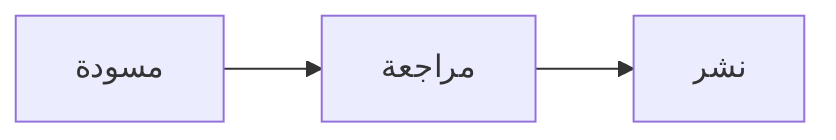

# دليل Markdown الكامل

مرجع عملي لكتابة مستندات Markdown ومراجعتها وتصديرها في **Moji**. يعرض كل قسم الصيغة والنتيجة.

## المحتويات

- [العناوين](#العناوين)
- [تنسيق النص](#تنسيق-النص)
- [الفقرات وفواصل الأسطر](#الفقرات-وفواصل-الأسطر)
- [القوائم والمهام](#القوائم-والمهام)
- [الروابط والصور](#الروابط-والصور)
- [الاقتباسات](#الاقتباسات)
- [الرمز البرمجي](#الرمز-البرمجي)
- [الجداول](#الجداول)
- [الصيغ الرياضية](#الصيغ-الرياضية)
- [HTML ومحارف الهروب](#html-ومحارف-الهروب)
- [الميزات الإضافية](#الميزات-الإضافية)
- [مخططات Mermaid](#مخططات-mermaid)
- [أفضل الممارسات](#أفضل-الممارسات)

---

## العناوين

استخدم من علامة `#` واحدة إلى ست علامات. يعتمد مخطط Moji الجانبي على هذه العناوين للتنقل، لذلك حافظ على ترتيب المستويات.

~~~markdown
# عنوان من المستوى الأول
## عنوان من المستوى الثاني
### عنوان من المستوى الثالث
#### عنوان من المستوى الرابع
##### عنوان من المستوى الخامس
###### عنوان من المستوى السادس
~~~

> نصيحة: استخدم عنواناً واحداً فقط بعلامة `#` ليكون العنوان الرئيسي للمستند.

## تنسيق النص

| الصيغة | النتيجة |
|---|---|
| `*مائل*` | *مائل* |
| `**عريض**` | **عريض** |
| `***عريض ومائل***` | ***عريض ومائل*** |
| `~~يتوسطه خط~~` | ~~يتوسطه خط~~ |
| `` `رمز ضمن السطر` `` | `رمز ضمن السطر` |

## الفقرات وفواصل الأسطر

افصل بين الفقرات بسطر فارغ. لإنشاء فاصل داخل الفقرة نفسها، اختم السطر بمسافتين أو بشرطة مائلة عكسية `\`.

~~~markdown
الفقرة الأولى.

الفقرة الثانية.

السطر الأول\
السطر الثاني
~~~

## القوائم والمهام

استخدم `-` أو `*` أو `+` للقوائم النقطية، واستخدم رقماً متبوعاً بنقطة للقوائم المرتبة. أزح العناصر الفرعية إلى الداخل.

~~~markdown
- العنصر الأول
  - عنصر فرعي
- العنصر الثاني

1. الخطوة الأولى
2. الخطوة الثانية

- [ ] مهمة معلّقة
- [x] مهمة مكتملة
~~~

## الروابط والصور

~~~markdown
[موقع Moji](https://github.com/alexishida/Moji)
<https://example.com>
[رابط مرجعي][ref]

[ref]: https://example.com "عنوان اختياري"


~~~

يجعل النص البديل الوصفي الصور متاحة لقارئات الشاشة. تستخدم الروابط الداخلية المعرّف المولّد من العنوان: `[العناوين](#العناوين)`.

## الاقتباسات

ضع `>` في بداية كل سطر. يمكن أن تحتوي الاقتباسات على عناصر أخرى، ويمكن تداخلها.

~~~markdown
> اقتباس بسيط.
>
> > اقتباس متداخل.
>
> — المؤلف، **المصدر**
~~~

## الرمز البرمجي

ضع الرمز ضمن السطر بين علامتي اقتباس خلفيتين. استخدم كتلة مسيّجة للأسطر المتعددة وحدد اللغة لتفعيل تمييز الصيغة.

~~~markdown
استخدم `renderMarkdown()` لإنشاء المعاينة.

```typescript
function greet(name: string): string {
  return `مرحباً، ${name}!`
}
```
~~~

## الجداول

تحدد النقطتان في سطر الفصل محاذاة الأعمدة.

~~~markdown
| الميزة | مدعومة | ملاحظة |
|:---|:---:|---:|
| الجداول | نعم | البيانات |
| المهام | نعم | المتابعة |
~~~

## الصيغ الرياضية

يستخدم Moji مكتبة KaTeX. ضع الصيغة ضمن السطر بين `$...$`، والصيغة المعروضة في الوسط بين `$$...$$`.

~~~markdown
تُعطى الطاقة بالصيغة $E = mc^2$.

$$
\sum_{i=1}^{n} i = \frac{n(n+1)}{2}
$$
~~~

صيغ مفيدة: `\frac{a}{b}` و`x^{2}` و`x_{i}` و`\sqrt{x}` و`\int_a^b f(x)\,dx`.

## الخطوط الأفقية

تُنشئ ثلاثة محارف `-` أو `*` أو `_` في سطر مستقل فاصلاً أفقياً.

~~~markdown
---
~~~

## HTML ومحارف الهروب

يقبل Moji عناصر HTML الآمنة، ويزيل الوسوم أو السمات الخطرة قبل المعاينة والتصدير.

~~~html
<details>
  <summary>عرض التفاصيل</summary>
  محتوى مخفي.
</details>
~~~

ضع `\` قبل محرف Markdown لعرضه حرفياً: `\*ليس مائلاً\*` أو `\# ليس عنواناً`.

## الميزات الإضافية

يدعم Moji أيضاً النص السفلي والعلوي والتمييز والإضافة والرموز التعبيرية والحواشي وقوائم التعريف والاختصارات.

~~~markdown
H~2~O و x^2^
==مهم== و ++مضاف++
:rocket: :white_check_mark:

نص له مصدر.[^source]
[^source]: تفاصيل المرجع.

Markdown
: لغة ترميز خفيفة.

*[HTML]: HyperText Markup Language
~~~

## مخططات Mermaid

يعرض Moji كتل Mermaid في المعاينة. انقر على المخطط لتكبيره أو تحريكه أو تصديره بصيغة PNG.

~~~markdown

~~~


<!-- MERMAID_EXAMPLES -->

## أفضل الممارسات

- ابدأ بعنوان رئيسي واحد بعلامة `#`، وحافظ على ترتيب المستويات.
- اترك سطراً فارغاً بين الكتل.
- حدد لغة كتل الرمز البرمجي.
- اكتب نصاً بديلاً لكل صورة.
- راجع المعاينة قبل التصدير إلى HTML أو PDF أو PNG.

---

> أُنشئ هذا الدليل من أجل **Moji**، قارئ Markdown ومحرره. في وضع التحرير يبقى الرمز المصدري لهذا الدليل للقراءة فقط.
