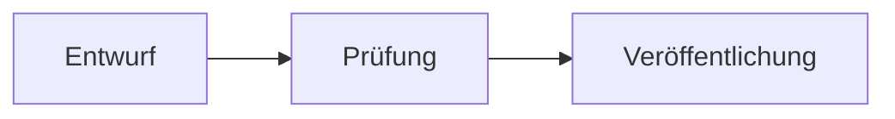

# Vollständige Markdown-Anleitung

Praktisches Nachschlagewerk zum Schreiben, Prüfen und Exportieren von Markdown-Dokumenten in **Moji**. Jeder Abschnitt zeigt Syntax und Ergebnis.

## Inhaltsverzeichnis

- [Überschriften](#überschriften)
- [Textformatierung](#textformatierung)
- [Absätze und Zeilenumbrüche](#absätze-und-zeilenumbrüche)
- [Listen und Aufgaben](#listen-und-aufgaben)
- [Links und Bilder](#links-und-bilder)
- [Zitate](#zitate)
- [Code](#code)
- [Tabellen](#tabellen)
- [Mathematische Formeln](#mathematische-formeln)
- [HTML und Escape-Zeichen](#html-und-escape-zeichen)
- [Erweiterte Funktionen](#erweiterte-funktionen)
- [Mermaid-Diagramme](#mermaid-diagramme)
- [Empfehlungen](#empfehlungen)

---

## Überschriften

Verwenden Sie ein bis sechs `#`-Zeichen. Die Seitenleiste von Moji nutzt diese Überschriften zur Navigation. Halten Sie deshalb eine sinnvolle Hierarchie ein.

~~~markdown
# Überschrift der Ebene 1
## Überschrift der Ebene 2
### Überschrift der Ebene 3
#### Überschrift der Ebene 4
##### Überschrift der Ebene 5
###### Überschrift der Ebene 6
~~~

> Tipp: Verwenden Sie nur eine Überschrift mit `#` als Haupttitel des Dokuments.

## Textformatierung

| Syntax | Ergebnis |
|---|---|
| `*kursiv*` | *kursiv* |
| `**fett**` | **fett** |
| `***fett und kursiv***` | ***fett und kursiv*** |
| `~~durchgestrichen~~` | ~~durchgestrichen~~ |
| `` `Code in einer Zeile` `` | `Code in einer Zeile` |

## Absätze und Zeilenumbrüche

Trennen Sie Absätze durch eine Leerzeile. Beenden Sie eine Zeile mit zwei Leerzeichen oder einem umgekehrten Schrägstrich `\`, um innerhalb desselben Absatzes einen Zeilenumbruch zu erzwingen.

~~~markdown
Erster Absatz.

Zweiter Absatz.

Erste Zeile\
Zweite Zeile
~~~

## Listen und Aufgaben

Verwenden Sie `-`, `*` oder `+` für Aufzählungen und Zahlen mit Punkt für nummerierte Listen. Rücken Sie untergeordnete Einträge ein.

~~~markdown
- Erster Eintrag
  - Untergeordneter Eintrag
- Zweiter Eintrag

1. Erster Schritt
2. Zweiter Schritt

- [ ] Offene Aufgabe
- [x] Erledigte Aufgabe
~~~

## Links und Bilder

~~~markdown
[Moji-Projektseite](https://github.com/alexishida/Moji)
<https://example.com>
[Referenzlink][ref]

[ref]: https://example.com "Optionaler Titel"


~~~

Ein aussagekräftiger Alternativtext macht Bilder barrierefrei. Interne Links verwenden die aus einer Überschrift erzeugte Kennung: `[Überschriften](#überschriften)`.

## Zitate

Setzen Sie `>` an den Anfang jeder Zeile. Zitate können weitere Elemente enthalten und verschachtelt werden.

~~~markdown
> Ein einfaches Zitat.
>
> > Ein verschachteltes Zitat.
>
> — Autor, **Quelle**
~~~

## Code

Schließen Sie Code in einer Zeile in Graviszeichen ein. Verwenden Sie für mehrere Zeilen einen umschlossenen Block und geben Sie die Sprache für die Syntaxhervorhebung an.

~~~markdown
Verwenden Sie `renderMarkdown()`, um die Vorschau zu erzeugen.

```typescript
function begruessen(name: string): string {
  return `Hallo, ${name}!`
}
```
~~~

## Tabellen

Doppelpunkte in der Trennzeile bestimmen die Ausrichtung der Spalten.

~~~markdown
| Funktion | Unterstützt | Hinweis |
|:---|:---:|---:|
| Tabellen | Ja | Daten |
| Aufgaben | Ja | Fortschritt |
~~~

## Mathematische Formeln

Moji verwendet KaTeX. Setzen Sie eine Formel in einer Zeile zwischen `$...$` und eine zentrierte Formel zwischen `$$...$$`.

~~~markdown
Die Energie ist durch $E = mc^2$ gegeben.

$$
\sum_{i=1}^{n} i = \frac{n(n+1)}{2}
$$
~~~

Nützliche Syntax: `\frac{a}{b}`, `x^{2}`, `x_{i}`, `\sqrt{x}`, `\int_a^b f(x)\,dx`.

## Horizontale Linien

Drei Zeichen `-`, `*` oder `_` in einer eigenen Zeile erzeugen eine Trennlinie.

~~~markdown
---
~~~

## HTML und Escape-Zeichen

Moji akzeptiert sicheres HTML und entfernt gefährliche Tags oder Attribute vor Vorschau und Export.

~~~html
<details>
  <summary>Details anzeigen</summary>
  Ausgeblendeter Inhalt.
</details>
~~~

Setzen Sie `\` vor ein Markdown-Zeichen, um es wörtlich darzustellen: `\*nicht kursiv\*` oder `\# keine Überschrift`.

## Erweiterte Funktionen

Moji unterstützt außerdem Tiefstellung, Hochstellung, Hervorhebung, Einfügung, Emojis, Fußnoten, Definitionslisten und Abkürzungen.

~~~markdown
H~2~O und x^2^
==wichtig== und ++hinzugefügt++
:rocket: :white_check_mark:

Text mit einer Quelle.[^quelle]
[^quelle]: Einzelheiten zur Referenz.

Markdown
: Leichte Auszeichnungssprache.

*[HTML]: HyperText Markup Language
~~~

## Mermaid-Diagramme

Moji stellt Mermaid-Blöcke in der Vorschau dar. Klicken Sie auf ein Diagramm, um es zu vergrößern, zu verschieben oder als PNG zu exportieren.

~~~markdown

~~~


<!-- MERMAID_EXAMPLES -->

## Empfehlungen

- Beginnen Sie mit einer einzigen Überschrift `#` und halten Sie die Reihenfolge der Ebenen ein.
- Lassen Sie zwischen Blöcken eine Leerzeile.
- Geben Sie bei Codeblöcken die Sprache an.
- Verfassen Sie für jedes Bild einen Alternativtext.
- Prüfen Sie die Vorschau vor dem Export als HTML, PDF oder PNG.

---

> Anleitung für **Moji**, Markdown-Reader und -Editor. Im Bearbeitungsmodus bleibt der Quelltext dieser Anleitung schreibgeschützt.
