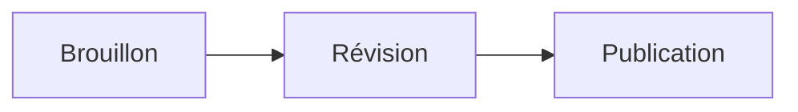

# Guide complet de Markdown

Référence pratique pour rédiger, relire et exporter des documents Markdown dans **Moji**. Chaque section présente la syntaxe et son résultat.

## Table des matières

- [Titres](#titres)
- [Mise en forme du texte](#mise-en-forme-du-texte)
- [Paragraphes et sauts de ligne](#paragraphes-et-sauts-de-ligne)
- [Listes et tâches](#listes-et-tâches)
- [Liens et images](#liens-et-images)
- [Citations](#citations)
- [Code](#code)
- [Tableaux](#tableaux)
- [Formules mathématiques](#formules-mathématiques)
- [HTML et caractères d’échappement](#html-et-caractères-dinterprétation)
- [Fonctions étendues](#fonctions-étendues)
- [Diagrammes Mermaid](#diagrammes-mermaid)
- [Bonnes pratiques](#bonnes-pratiques)

---

## Titres

Utilisez de un à six caractères `#`. Le plan latéral de Moji utilise ces titres pour la navigation ; conservez donc une hiérarchie cohérente.

~~~markdown
# Titre de niveau 1
## Titre de niveau 2
### Titre de niveau 3
#### Titre de niveau 4
##### Titre de niveau 5
###### Titre de niveau 6
~~~

> Conseil : utilisez un seul titre `#` comme titre principal du document.

## Mise en forme du texte

| Syntaxe | Résultat |
|---|---|
| `*italique*` | *italique* |
| `**gras**` | **gras** |
| `***gras et italique***` | ***gras et italique*** |
| `~~barré~~` | ~~barré~~ |
| `` `code en ligne` `` | `code en ligne` |

## Paragraphes et sauts de ligne

Séparez les paragraphes par une ligne vide. Pour forcer un saut de ligne dans le même paragraphe, terminez la ligne par deux espaces ou une barre oblique inverse `\`.

~~~markdown
Premier paragraphe.

Deuxième paragraphe.

Première ligne\
Deuxième ligne
~~~

## Listes et tâches

Utilisez `-`, `*` ou `+` pour une liste à puces et des nombres suivis d’un point pour une liste ordonnée. Indentez les sous-éléments.

~~~markdown
- Premier élément
  - Sous-élément
- Deuxième élément

1. Première étape
2. Deuxième étape

- [ ] Tâche à faire
- [x] Tâche terminée
~~~

## Liens et images

~~~markdown
[Site de Moji](https://github.com/alexishida/Moji)
<https://example.com>
[Lien de référence][ref]

[ref]: https://example.com "Titre facultatif"


~~~

Un texte alternatif descriptif rend les images accessibles. Les liens internes utilisent l’identifiant généré à partir d’un titre : `[Titres](#titres)`.

## Citations

Ajoutez `>` au début de chaque ligne. Les citations peuvent contenir d’autres éléments et être imbriquées.

~~~markdown
> Une citation simple.
>
> > Une citation imbriquée.
>
> — Auteur, **Source**
~~~

## Code

Entourez le code en ligne d’accents graves. Pour plusieurs lignes, utilisez un bloc clôturé et indiquez le langage afin d’activer la coloration syntaxique.

~~~markdown
Utilisez `renderMarkdown()` pour produire l’aperçu.

```typescript
function saluer(nom: string): string {
  return `Bonjour, ${nom} !`
}
```
~~~

## Tableaux

Les deux-points de la ligne de séparation définissent l’alignement des colonnes.

~~~markdown
| Fonction | Prise en charge | Remarque |
|:---|:---:|---:|
| Tableaux | Oui | Données |
| Tâches | Oui | Suivi |
~~~

## Formules mathématiques

Moji utilise KaTeX. Placez une formule en ligne entre `$...$` et une formule centrée entre `$$...$$`.

~~~markdown
L’énergie est donnée par $E = mc^2$.

$$
\sum_{i=1}^{n} i = \frac{n(n+1)}{2}
$$
~~~

Syntaxes utiles : `\frac{a}{b}`, `x^{2}`, `x_{i}`, `\sqrt{x}`, `\int_a^b f(x)\,dx`.

## Règles horizontales

Trois caractères `-`, `*` ou `_` sur une ligne distincte créent une séparation.

~~~markdown
---
~~~

## HTML et caractères d’interprétation

Moji accepte le HTML sûr et supprime les balises ou attributs dangereux avant l’aperçu et l’exportation.

~~~html
<details>
  <summary>Afficher les détails</summary>
  Contenu masqué.
</details>
~~~

Ajoutez `\` devant un caractère Markdown pour l’afficher littéralement : `\*pas en italique\*` ou `\# pas un titre`.

## Fonctions étendues

Moji prend également en charge les indices, exposants, surlignages, insertions, émojis, notes de bas de page, listes de définitions et abréviations.

~~~markdown
H~2~O et x^2^
==important== et ++ajouté++
:rocket: :white_check_mark:

Texte avec une source.[^source]
[^source]: Détail de la référence.

Markdown
: Langage de balisage léger.

*[HTML]: HyperText Markup Language
~~~

## Diagrammes Mermaid

Moji rend les blocs Mermaid dans l’aperçu. Cliquez sur un diagramme pour l’agrandir, le déplacer ou l’exporter en PNG.

~~~markdown

~~~


<!-- MERMAID_EXAMPLES -->

## Bonnes pratiques

- Commencez par un seul titre `#` et respectez l’ordre des niveaux.
- Laissez une ligne vide entre les blocs.
- Indiquez le langage des blocs de code.
- Rédigez un texte alternatif pour chaque image.
- Vérifiez l’aperçu avant d’exporter en HTML, PDF ou PNG.

---

> Guide créé pour **Moji**, lecteur et éditeur Markdown. En mode d’édition, le code source de ce guide reste en lecture seule.
