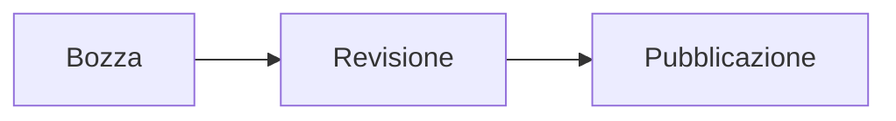

# Guida completa a Markdown

Riferimento pratico per scrivere, rivedere ed esportare documenti Markdown in **Moji**. Ogni sezione mostra la sintassi e il relativo risultato.

## Indice

- [Titoli](#titoli)
- [Formattazione del testo](#formattazione-del-testo)
- [Paragrafi e interruzioni di riga](#paragrafi-e-interruzioni-di-riga)
- [Elenchi e attività](#elenchi-e-attività)
- [Collegamenti e immagini](#collegamenti-e-immagini)
- [Citazioni](#citazioni)
- [Codice](#codice)
- [Tabelle](#tabelle)
- [Formule matematiche](#formule-matematiche)
- [HTML e caratteri di escape](#html-e-caratteri-di-escape)
- [Funzioni estese](#funzioni-estese)
- [Diagrammi Mermaid](#diagrammi-mermaid)
- [Buone pratiche](#buone-pratiche)

---

## Titoli

Usa da uno a sei caratteri `#`. La struttura laterale di Moji usa questi titoli per la navigazione, quindi mantieni una gerarchia coerente.

~~~markdown
# Titolo di livello 1
## Titolo di livello 2
### Titolo di livello 3
#### Titolo di livello 4
##### Titolo di livello 5
###### Titolo di livello 6
~~~

> Suggerimento: usa un solo titolo `#` come titolo principale del documento.

## Formattazione del testo

| Sintassi | Risultato |
|---|---|
| `*corsivo*` | *corsivo* |
| `**grassetto**` | **grassetto** |
| `***grassetto e corsivo***` | ***grassetto e corsivo*** |
| `~~barrato~~` | ~~barrato~~ |
| `` `codice in linea` `` | `codice in linea` |

## Paragrafi e interruzioni di riga

Separa i paragrafi con una riga vuota. Per forzare un’interruzione nello stesso paragrafo, termina la riga con due spazi o con una barra inversa `\`.

~~~markdown
Primo paragrafo.

Secondo paragrafo.

Prima riga\
Seconda riga
~~~

## Elenchi e attività

Usa `-`, `*` o `+` per gli elenchi puntati e numeri seguiti da un punto per quelli numerati. Rientra gli elementi secondari.

~~~markdown
- Primo elemento
  - Elemento secondario
- Secondo elemento

1. Primo passaggio
2. Secondo passaggio

- [ ] Attività da svolgere
- [x] Attività completata
~~~

## Collegamenti e immagini

~~~markdown
[Sito di Moji](https://github.com/alexishida/Moji)
<https://example.com>
[Collegamento di riferimento][ref]

[ref]: https://example.com "Titolo facoltativo"


~~~

Un testo alternativo descrittivo rende accessibili le immagini. I collegamenti interni usano l’identificatore generato da un titolo: `[Titoli](#titoli)`.

## Citazioni

Inserisci `>` all’inizio di ogni riga. Le citazioni possono contenere altri elementi ed essere annidate.

~~~markdown
> Una citazione semplice.
>
> > Una citazione annidata.
>
> — Autore, **Fonte**
~~~

## Codice

Racchiudi il codice in linea tra accenti gravi. Per più righe usa un blocco delimitato e indica il linguaggio per attivare l’evidenziazione della sintassi.

~~~markdown
Usa `renderMarkdown()` per generare l’anteprima.

```typescript
function saluta(nome: string): string {
  return `Ciao, ${nome}!`
}
```
~~~

## Tabelle

I due punti nella riga di separazione definiscono l’allineamento delle colonne.

~~~markdown
| Funzione | Supportata | Nota |
|:---|:---:|---:|
| Tabelle | Sì | Dati |
| Attività | Sì | Monitoraggio |
~~~

## Formule matematiche

Moji usa KaTeX. Inserisci una formula in linea tra `$...$` e una formula centrata tra `$$...$$`.

~~~markdown
L’energia è data da $E = mc^2$.

$$
\sum_{i=1}^{n} i = \frac{n(n+1)}{2}
$$
~~~

Sintassi utili: `\frac{a}{b}`, `x^{2}`, `x_{i}`, `\sqrt{x}`, `\int_a^b f(x)\,dx`.

## Regole orizzontali

Tre caratteri `-`, `*` o `_` su una riga separata creano un divisore.

~~~markdown
---
~~~

## HTML e caratteri di escape

Moji accetta HTML sicuro e rimuove tag o attributi pericolosi prima dell’anteprima e dell’esportazione.

~~~html
<details>
  <summary>Mostra dettagli</summary>
  Contenuto nascosto.
</details>
~~~

Inserisci `\` prima di un carattere Markdown per visualizzarlo letteralmente: `\*non corsivo\*` oppure `\# non è un titolo`.

## Funzioni estese

Moji supporta anche pedici, apici, evidenziazioni, inserimenti, emoji, note a piè di pagina, elenchi di definizioni e abbreviazioni.

~~~markdown
H~2~O e x^2^
==importante== e ++aggiunto++
:rocket: :white_check_mark:

Testo con una fonte.[^fonte]
[^fonte]: Dettaglio del riferimento.

Markdown
: Linguaggio di markup leggero.

*[HTML]: HyperText Markup Language
~~~

## Diagrammi Mermaid

Moji visualizza i blocchi Mermaid nell’anteprima. Fai clic su un diagramma per ingrandirlo, spostarlo o esportarlo come PNG.

~~~markdown

~~~


<!-- MERMAID_EXAMPLES -->

## Buone pratiche

- Inizia con un solo titolo `#` e rispetta l’ordine dei livelli.
- Lascia una riga vuota tra i blocchi.
- Indica il linguaggio dei blocchi di codice.
- Scrivi un testo alternativo per ogni immagine.
- Controlla l’anteprima prima di esportare in HTML, PDF o PNG.

---

> Guida creata per **Moji**, lettore ed editor Markdown. In modalità di modifica, il codice sorgente di questa guida rimane di sola lettura.
