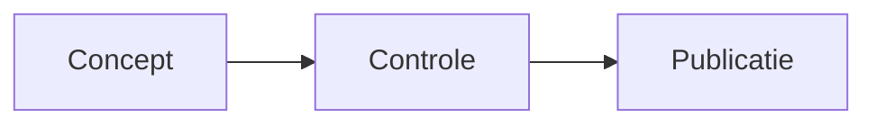

# Volledige Markdown-handleiding

Praktische naslag voor het schrijven, controleren en exporteren van Markdown-documenten in **Moji**. Elke sectie toont de syntaxis en het resultaat.

## Inhoudsopgave

- [Koppen](#koppen)
- [Tekstopmaak](#tekstopmaak)
- [Alinea’s en regeleinden](#alineas-en-regeleinden)
- [Lijsten en taken](#lijsten-en-taken)
- [Koppelingen en afbeeldingen](#koppelingen-en-afbeeldingen)
- [Citaten](#citaten)
- [Code](#code)
- [Tabellen](#tabellen)
- [Wiskundige formules](#wiskundige-formules)
- [HTML en escape-tekens](#html-en-escape-tekens)
- [Uitgebreide functies](#uitgebreide-functies)
- [Mermaid-diagrammen](#mermaid-diagrammen)
- [Aanbevolen werkwijzen](#aanbevolen-werkwijzen)

---

## Koppen

Gebruik één tot zes `#`-tekens. Het zijpaneel van Moji gebruikt deze koppen voor navigatie; houd de niveaus daarom in logische volgorde.

~~~markdown
# Kop van niveau 1
## Kop van niveau 2
### Kop van niveau 3
#### Kop van niveau 4
##### Kop van niveau 5
###### Kop van niveau 6
~~~

> Tip: gebruik één kop met `#` als hoofdtitel van het document.

## Tekstopmaak

| Syntaxis | Resultaat |
|---|---|
| `*cursief*` | *cursief* |
| `**vet**` | **vet** |
| `***vet en cursief***` | ***vet en cursief*** |
| `~~doorgestreept~~` | ~~doorgestreept~~ |
| `` `inlinecode` `` | `inlinecode` |

## Alinea’s en regeleinden

Scheid alinea’s met een lege regel. Eindig een regel met twee spaties of een backslash `\` om binnen dezelfde alinea een regeleinde af te dwingen.

~~~markdown
Eerste alinea.

Tweede alinea.

Eerste regel\
Tweede regel
~~~

## Lijsten en taken

Gebruik `-`, `*` of `+` voor opsommingen en getallen met een punt voor genummerde lijsten. Laat onderliggende items inspringen.

~~~markdown
- Eerste item
  - Onderliggend item
- Tweede item

1. Eerste stap
2. Tweede stap

- [ ] Openstaande taak
- [x] Voltooide taak
~~~

## Koppelingen en afbeeldingen

~~~markdown
[Moji-website](https://github.com/alexishida/Moji)
<https://example.com>
[Verwijzingskoppeling][ref]

[ref]: https://example.com "Optionele titel"


~~~

Beschrijvende alternatieve tekst maakt afbeeldingen toegankelijk. Interne koppelingen gebruiken de id van een kop: `[Koppen](#koppen)`.

## Citaten

Plaats `>` aan het begin van elke regel. Citaten kunnen andere elementen bevatten en worden genest.

~~~markdown
> Een eenvoudig citaat.
>
> > Een genest citaat.
>
> — Auteur, **Bron**
~~~

## Code

Zet inlinecode tussen backticks. Gebruik voor meerdere regels een omheind blok en vermeld de taal om syntaxismarkering in te schakelen.

~~~markdown
Gebruik `renderMarkdown()` om het voorbeeld te maken.

```typescript
function begroet(naam: string): string {
  return `Hallo, ${naam}!`
}
```
~~~

## Tabellen

Dubbele punten in de scheidingsregel bepalen de uitlijning van kolommen.

~~~markdown
| Functie | Ondersteund | Opmerking |
|:---|:---:|---:|
| Tabellen | Ja | Gegevens |
| Taken | Ja | Voortgang |
~~~

## Wiskundige formules

Moji gebruikt KaTeX. Zet een inlineformule tussen `$...$` en een gecentreerde formule tussen `$$...$$`.

~~~markdown
De energie wordt gegeven door $E = mc^2$.

$$
\sum_{i=1}^{n} i = \frac{n(n+1)}{2}
$$
~~~

Handige syntaxis: `\frac{a}{b}`, `x^{2}`, `x_{i}`, `\sqrt{x}`, `\int_a^b f(x)\,dx`.

## Horizontale lijnen

Drie tekens `-`, `*` of `_` op een aparte regel maken een scheidingslijn.

~~~markdown
---
~~~

## HTML en escape-tekens

Moji accepteert veilige HTML en verwijdert gevaarlijke tags of attributen vóór weergave en export.

~~~html
<details>
  <summary>Details tonen</summary>
  Verborgen inhoud.
</details>
~~~

Plaats `\` voor een Markdown-teken om het letterlijk weer te geven: `\*niet cursief\*` of `\# geen kop`.

## Uitgebreide functies

Moji ondersteunt ook subscript, superscript, markering, invoeging, emoji, voetnoten, definitielijsten en afkortingen.

~~~markdown
H~2~O en x^2^
==belangrijk== en ++toegevoegd++
:rocket: :white_check_mark:

Tekst met een bron.[^bron]
[^bron]: Details van de verwijzing.

Markdown
: Lichtgewicht opmaaktaal.

*[HTML]: HyperText Markup Language
~~~

## Mermaid-diagrammen

Moji toont Mermaid-blokken in het voorbeeld. Klik op een diagram om het te vergroten, te verschuiven of als PNG te exporteren.

~~~markdown

~~~


<!-- MERMAID_EXAMPLES -->

## Aanbevolen werkwijzen

- Begin met één kop `#` en houd de niveaus in de juiste volgorde.
- Laat een lege regel tussen blokken.
- Vermeld de taal van codeblokken.
- Schrijf alternatieve tekst voor elke afbeelding.
- Controleer het voorbeeld vóór export naar HTML, PDF of PNG.

---

> Handleiding gemaakt voor **Moji**, Markdown-lezer en -editor. In de bewerkingsmodus blijft de broncode van deze handleiding alleen-lezen.
