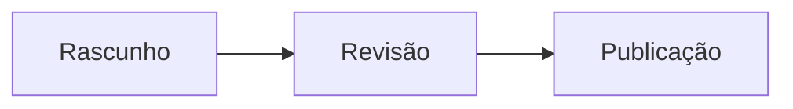

# Guia completo de Markdown

Referência prática para escrever, rever e exportar documentos Markdown no **Moji**. Cada secção apresenta a sintaxe e o respetivo resultado.

## Índice

- [Títulos](#títulos)
- [Formatação de texto](#formatação-de-texto)
- [Parágrafos e quebras de linha](#parágrafos-e-quebras-de-linha)
- [Listas e tarefas](#listas-e-tarefas)
- [Ligações e imagens](#ligações-e-imagens)
- [Citações](#citações)
- [Código](#código)
- [Tabelas](#tabelas)
- [Fórmulas matemáticas](#fórmulas-matemáticas)
- [HTML e caracteres de escape](#html-e-caracteres-de-escape)
- [Funcionalidades adicionais](#funcionalidades-adicionais)
- [Diagramas Mermaid](#diagramas-mermaid)
- [Boas práticas](#boas-práticas)

---

## Títulos

Utilize entre um e seis caracteres `#`. O painel de tópicos do Moji utiliza estes títulos para navegação, pelo que deve manter uma hierarquia coerente.

~~~markdown
# Título de nível 1
## Título de nível 2
### Título de nível 3
#### Título de nível 4
##### Título de nível 5
###### Título de nível 6
~~~

> Sugestão: utilize apenas um título `#` como título principal do documento.

## Formatação de texto

| Sintaxe | Resultado |
|---|---|
| `*itálico*` | *itálico* |
| `**negrito**` | **negrito** |
| `***negrito e itálico***` | ***negrito e itálico*** |
| `~~rasurado~~` | ~~rasurado~~ |
| `` `código na linha` `` | `código na linha` |

## Parágrafos e quebras de linha

Separe os parágrafos com uma linha em branco. Para forçar uma quebra dentro do mesmo parágrafo, termine a linha com dois espaços ou com uma barra invertida `\`.

~~~markdown
Primeiro parágrafo.

Segundo parágrafo.

Primeira linha\
Segunda linha
~~~

## Listas e tarefas

Utilize `-`, `*` ou `+` para listas com marcadores e números seguidos de ponto para listas ordenadas. Indente os itens secundários.

~~~markdown
- Primeiro item
  - Item secundário
- Segundo item

1. Primeiro passo
2. Segundo passo

- [ ] Tarefa por fazer
- [x] Tarefa concluída
~~~

## Ligações e imagens

~~~markdown
[Página do Moji](https://github.com/alexishida/Moji)
<https://example.com>
[Ligação de referência][ref]

[ref]: https://example.com "Título opcional"


~~~

Um texto alternativo descritivo torna as imagens acessíveis. As ligações internas utilizam o identificador gerado a partir de um título: `[Títulos](#títulos)`.

## Citações

Coloque `>` no início de cada linha. As citações podem conter outros elementos e ser aninhadas.

~~~markdown
> Uma citação simples.
>
> > Uma citação aninhada.
>
> — Autor, **Fonte**
~~~

## Código

Coloque código na linha entre acentos graves. Para várias linhas, utilize um bloco delimitado e indique a linguagem para ativar o realce de sintaxe.

~~~markdown
Utilize `renderMarkdown()` para gerar a pré-visualização.

```typescript
function cumprimentar(nome: string): string {
  return `Olá, ${nome}!`
}
```
~~~

## Tabelas

Os dois pontos na linha de separação definem o alinhamento das colunas.

~~~markdown
| Funcionalidade | Suportada | Observação |
|:---|:---:|---:|
| Tabelas | Sim | Dados |
| Tarefas | Sim | Acompanhamento |
~~~

## Fórmulas matemáticas

O Moji utiliza KaTeX. Coloque uma fórmula na linha entre `$...$` e uma fórmula centrada entre `$$...$$`.

~~~markdown
A energia é dada por $E = mc^2$.

$$
\sum_{i=1}^{n} i = \frac{n(n+1)}{2}
$$
~~~

Sintaxes úteis: `\frac{a}{b}`, `x^{2}`, `x_{i}`, `\sqrt{x}`, `\int_a^b f(x)\,dx`.

## Linhas horizontais

Três caracteres `-`, `*` ou `_` numa linha separada criam um divisor.

~~~markdown
---
~~~

## HTML e caracteres de escape

O Moji aceita HTML seguro e remove etiquetas ou atributos perigosos antes da pré-visualização e da exportação.

~~~html
<details>
  <summary>Mostrar detalhes</summary>
  Conteúdo oculto.
</details>
~~~

Coloque `\` antes de um carácter Markdown para o apresentar literalmente: `\*não fica em itálico\*` ou `\# não é um título`.

## Funcionalidades adicionais

O Moji também suporta texto subscrito e sobrescrito, destaque, inserção, emojis, notas de rodapé, listas de definições e abreviaturas.

~~~markdown
H~2~O e x^2^
==importante== e ++adicionado++
:rocket: :white_check_mark:

Texto com uma fonte.[^fonte]
[^fonte]: Detalhes da referência.

Markdown
: Linguagem de marcação leve.

*[HTML]: HyperText Markup Language
~~~

## Diagramas Mermaid

O Moji apresenta blocos Mermaid na pré-visualização. Clique num diagrama para o ampliar, deslocar ou exportar como PNG.

~~~markdown

~~~


<!-- MERMAID_EXAMPLES -->

## Boas práticas

- Comece com um único título `#` e respeite a ordem dos níveis.
- Deixe uma linha em branco entre os blocos.
- Indique a linguagem dos blocos de código.
- Escreva texto alternativo para todas as imagens.
- Reveja a pré-visualização antes de exportar para HTML, PDF ou PNG.

---

> Guia criado para o **Moji**, leitor e editor de Markdown. No modo de edição, o código-fonte deste guia permanece só de leitura.
