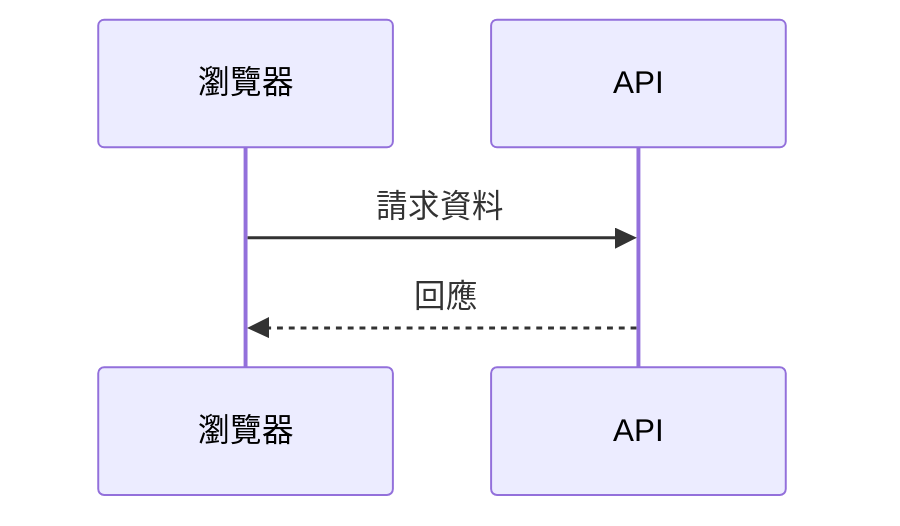
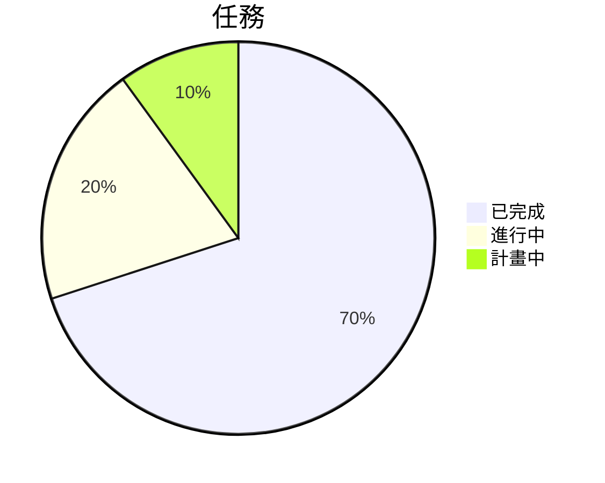

# Markdown 完整指南

在 **Moji** 中編寫、審閱與匯出文件的 Markdown 實用參考。
每個部分都展示語法，並在適當處顯示算繪結果。

## 目錄

- [標題](#%E6%A8%99%E9%A1%8C)
- [強調與文字樣式](#%E5%BC%B7%E8%AA%BF%E8%88%87%E6%96%87%E5%AD%97%E6%A8%A3%E5%BC%8F)
- [段落與換行](#%E6%AE%B5%E8%90%BD%E8%88%87%E6%8F%9B%E8%A1%8C)
- [清單](#%E6%B8%85%E5%96%AE)
- [任務清單](#%E4%BB%BB%E5%8B%99%E6%B8%85%E5%96%AE)
- [連結](#%E9%80%A3%E7%B5%90)
- [圖片](#%E5%9C%96%E7%89%87)
- [引用](#%E5%BC%95%E7%94%A8)
- [程式碼](#%E7%A8%8B%E5%BC%8F%E7%A2%BC)
- [表格](#%E8%A1%A8%E6%A0%BC)
- [數學公式](#%E6%95%B8%E5%AD%B8%E5%85%AC%E5%BC%8F)
- [水平線](#%E6%B0%B4%E5%B9%B3%E7%B7%9A)
- [內嵌 HTML](#%E5%85%A7%E5%B5%8C-html)
- [跳脫字元](#%E8%B7%B3%E8%84%AB%E5%AD%97%E5%85%83)
- [表情與符號](#%E8%A1%A8%E6%83%85%E8%88%87%E7%AC%A6%E8%99%9F)
- [擴充功能](#%E6%93%B4%E5%85%85%E5%8A%9F%E8%83%BD)
- [Mermaid 圖表](#mermaid-%E5%9C%96%E8%A1%A8)
- [最佳作法](#%E6%9C%80%E4%BD%B3%E4%BD%9C%E6%B3%95)

---

## 標題

使用一到六個 `#` 建立 1 到 6 級標題。Moji 的側邊欄大綱會使用這些標題導覽，請依序維持層級。

~~~markdown
# 一級標題
## 二級標題
### 三級標題
#### 四級標題
##### 五級標題
###### 六級標題
~~~

> 提示：每個文件只使用**一個** `#` 作為頁面的主標題。

---

## 強調與文字樣式

| 語法 | 效果 |
|---------|-----------|
| `*斜體*` 或 `_斜體_` | *斜體* |
| `**粗體**` 或 `__粗體__` | **粗體** |
| `***粗斜體***` | ***粗斜體*** |
| `~~刪除線~~` | ~~刪除線~~ |
| `` `行內程式碼` `` | `行內程式碼` |

使用範例：

> 執行 `npm run typecheck` 時，**TypeScript** 在不產生檔案的情況下進行驗證；錯誤會*以內嵌方式*顯示在終端機中。

---

## 段落與換行

用**空行**分隔段落。沒有空行的簡單換行預設會被忽略。

~~~markdown
第一段。

第二段，用空行分隔。
~~~

要在同一段落內強制換行，在行末加**兩個空格**或使用 `\`：

~~~markdown
第一行\
同一思路的第二行
~~~

---

## 清單

**無序清單** — 使用 `-`、`*` 或 `+`。用兩個空格縮排來巢狀。

~~~markdown
- 主專案
  - 子專案
    - 子子專案
- 另一個專案
~~~

效果：

- 主專案
  - 子專案
    - 子子專案
- 另一個專案

**有序清單** — 數字後跟句點。Markdown 會自動重新編號。

~~~markdown
1. 第一步
2. 第二步
   1. 子步驟 A
   2. 子步驟 B
3. 第三步
~~~

效果：

1. 第一步
2. 第二步
   1. 子步驟 A
   2. 子步驟 B
3. 第三步

---

## 任務清單

使用 `- [ ]` 表示待辦，`- [x]` 表示已完成。

~~~markdown
- [x] 編寫指南
- [x] 新增表格
- [ ] 匯出前審閱
~~~

效果：

- [x] 編寫指南
- [x] 新增表格
- [ ] 匯出前審閱

---

## 連結

~~~markdown
[內嵌連結](https://example.com)
[帶標題的連結](https://example.com "暫留時顯示")
<https://example.com>  ← 自動連結
[引用式連結][ref]

[ref]: https://example.com
~~~

內部連結指向標題的 *slug*（與大綱使用的相同）：

~~~markdown
返回[目錄](#%E7%9B%AE%E9%8C%84)。
~~~

> 在 Moji 中，`http`/`https` 連結會在系統瀏覽器的新標籤頁中開啟，並帶有 `rel="noopener noreferrer"`。

---

## 圖片

與連結語法相同，前面加 `!`。方括號中的文字是**替代文字**（用於無障礙存取）。

~~~markdown


~~~

始終在替代文字中描述圖片 — 螢幕閱讀器和匯出功能依賴於此。

---

## 引用

在行首使用 `>`。可以包含其他元素，也可以巢狀。

~~~markdown
> 簡單引用。
>
> > 巢狀引用。
>
> — 作者，**來源**
~~~

效果：

> 簡單引用。
>
> > 巢狀引用。
>
> — 作者，**來源**

---

## 程式碼

**行內程式碼：** 用單一反引號包裹 — `` `renderMarkdown()` ``

**程式碼區塊：** 使用三個反引號圍欄，並指定語言以啟用語法醒目提示（由 `highlight.js` 提供支援）。

~~~markdown
```ts
export function renderMarkdown(source: string): string {
  const html = md.render(source ?? '')
  return DOMPurify.sanitize(html)
}
```
~~~

效果：

```ts
export function renderMarkdown(source: string): string {
  const html = md.render(source ?? '')
  return DOMPurify.sanitize(html)
}
```

其他語言範例：

```bash
npm install
npm run dev
```

```json
{
  "name": "moji",
  "version": "0.1.0"
}
```

---

## 表格

列用 `|` 分隔。第二行定義分隔線和**對齊方式**：

- `:---` 左對齊
- `:---:` 置中對齊
- `---:` 右對齊

~~~markdown
| 功能     | 支援情況 | 備註               |
| :------- | :------: | -----------------: |
| 表格     |    是    |     非常適合資料   |
| 任務     |    是    |   適合檢查清單     |
| 語法醒目提示 |    是    |   透過 highlight.js |
~~~

效果：

| 功能     | 支援情況 | 備註               |
| :------- | :------: | -----------------: |
| 表格     |    是    |     非常適合資料   |
| 任務     |    是    |   適合檢查清單     |
| 語法醒目提示 |    是    |   透過 highlight.js |

更詳細的對比表格：

| 格式     | 副檔名     | Moji 中可匯出 | 最適合             |
| -------- | ---------- | :-----------: | ------------------ |
| HTML     | `.html`    |      是       | 網頁發佈           |
| PDF      | `.pdf`     |      是       | 列印 / 歸檔        |
| PNG      | `.png`     |      是       | 截圖和預覽         |
| Markdown | `.md`      |      是       | 編輯原始檔         |

> 單元格支援格式：**粗體**、*斜體*、`程式碼` 和連結。

---

## 數學公式

標準約定使用美元符號包裹 **LaTeX**：`$...$` 用於**行內**公式，`$$...$$` 用於**顯示**（區塊、置中）公式。

**行內公式：**

~~~markdown
能量由 $E = mc^2$ 給出，定理為 $a^2 + b^2 = c^2$。
~~~

效果：能量由 $E = mc^2$ 給出，定理為 $a^2 + b^2 = c^2$。

**顯示公式：**

~~~markdown
$$
x = \frac{-b \pm \sqrt{b^2 - 4ac}}{2a}
$$
~~~

效果：

$$
x = \frac{-b \pm \sqrt{b^2 - 4ac}}{2a}
$$

實用語法範例：

| 用途           | LaTeX                                   |
| --------------- | --------------------------------------- |
| 分數            | `\frac{a}{b}`                           |
| 上標            | `x^{2}`                                 |
| 下標            | `x_{i}`                                 |
| 根號            | `\sqrt{x}` · `\sqrt[3]{x}`              |
| 求和            | `\sum_{i=1}^{n} i`                       |
| 積分            | `\int_{a}^{b} f(x)\,dx`                  |
| 極限            | `\lim_{x \to \infty} f(x)`              |
| 希臘字母        | `\alpha \beta \gamma \pi \Sigma \Omega` |
| 向量            | `\vec{v}`                               |
| 矩陣            | `\begin{bmatrix} a & b \\ c & d \end{bmatrix}` |

完整區塊範例：

~~~markdown
$$
\sum_{i=1}^{n} i = \frac{n(n+1)}{2}
\qquad
e^{i\pi} + 1 = 0
$$

$$
\int_{0}^{\infty} e^{-x^2}\,dx = \frac{\sqrt{\pi}}{2}
$$

$$
A = \begin{bmatrix} 1 & 2 \\ 3 & 4 \end{bmatrix}
$$
~~~

效果：

$$
\sum_{i=1}^{n} i = \frac{n(n+1)}{2}
\qquad
e^{i\pi} + 1 = 0
$$

$$
\int_{0}^{\infty} e^{-x^2}\,dx = \frac{\sqrt{\pi}}{2}
$$

$$
A = \begin{bmatrix} 1 & 2 \\ 3 & 4 \end{bmatrix}
$$

> **在 Moji 中：** 公式使用 **KaTeX** 算繪 — `$…$` 顯示為行內公式，`$$…$$` 顯示為置中區塊公式。過寬的公式將獲得水平滾動，無效的公式將顯示為紅色錯誤文字，不會破壞文件的其餘部分。

---

## 水平線

三個或更多 `-`、`*` 或 `_` 獨佔一行，前後各有一個空行。

~~~markdown
---
~~~

產生一條分隔線：

---

## 內嵌 HTML

Markdown 接受純 HTML 來處理語法無法覆蓋的情況。在 Moji 中，所有內容都經過 **DOMPurify** 處理：不安全的標籤和屬性（如 `<script>` 或 `onclick`）會在預覽和匯出前被移除。

~~~markdown
<details>
  <summary>點按展開</summary>

  隱藏內容，點按後顯示。
</details>
~~~

效果：

<details>
  <summary>點按展開</summary>

  隱藏內容，點按後顯示。
</details>

---

## 跳脫字元

在特殊字元前使用 `\` 可以按字面顯示，而不被解釋。

~~~markdown
\*這不會變成斜體\*
\# 這不會變成標題
1\. 這不會開始清單
~~~

常見可跳脫字元：`` \ ` * _ { } [ ] ( ) # + - . ! | ``

---

## 表情與符號

直接貼上 Unicode 表情 — 它們可用於標題、清單和表格。

~~~markdown
- ✅ 已完成
- 🚧 進行中
- ❌ 已受阻
- 💡 想法
- ⚠️ 警告
~~~

效果：

- ✅ 已完成
- 🚧 進行中
- ❌ 已受阻
- 💡 想法
- ⚠️ 警告

透過 HTML 使用的常見符號：`&copy;` → &copy;，`&rarr;` → &rarr;，`&hearts;` → &hearts;。

---

## 擴充功能

除了基本 Markdown 之外，Moji 還算繪常見的擴充。

**下標和上標** — `~x~` 和 `^x^`：

~~~markdown
H~2~O · 面積 = πr^2^ · a^n^ + b^n^
~~~

效果：H~2~O · 面積 = πr^2^ · a^n^ + b^n^

**醒目提示和插入** — `==文字==` 和 `++文字++`：

~~~markdown
這是 ==重要的==，這是 ++插入的++。
~~~

效果：這是 ==重要的==，這是 ++插入的++。

**快捷表情** — `:名稱:`：

~~~markdown
:rocket: :sparkles: :white_check_mark: :warning: :bulb:
~~~

效果：:rocket: :sparkles: :white_check_mark: :warning: :bulb:

**腳註** — 用 `[^id]` 標記，在任意位置定義註釋；它會顯示在文件底部。

~~~markdown
帶有來源的宣告。[^來源]

[^來源]: 參考詳細資訊，顯示在文件結尾。
~~~

效果：帶有來源的宣告。[^來源]

**定義清單** — 術語後跟以 `:` 開頭的行。

~~~markdown
Markdown
: 一種用於格式化文字的輕量級標記語言。

KaTeX
: 一種快速的 LaTeX 數學公式算繪引擎。
~~~

效果：

Markdown
: 一種用於格式化文字的輕量級標記語言。

KaTeX
: 一種快速的 LaTeX 數學公式算繪引擎。

**縮寫** — 定義一個縮寫，所有出現的地方都會在暫留時顯示提示。

~~~markdown
*[HTML]: HyperText Markup Language
~~~

*[HTML]: HyperText Markup Language

[^來源]: 參考詳細資訊，顯示在文件結尾。

---

## Mermaid 圖表

Moji 會在預覽中算繪 Mermaid 圖表。點按已算繪的圖表，可在檢視器中縮放、拖移並匯出 PNG。

**流程圖**：

~~~markdown

~~~


**時序圖**：



**餅圖**：



<!-- MERMAID_EXAMPLES -->

---

## 最佳作法

- 以**一個** `#` 標題開頭，並按順序保持層級層次結構。
- 在塊之間（標題、清單、表格、引用）留**空行**。
- 多行程式碼優先使用帶語言標記的圍欄式程式碼區塊。
- 為每張圖片編寫描述性的**替代文字**。
- 使用表格進行比較；使用清單表示順序或集合。
- 匯出為 HTML、PDF 或 PNG **之前先預覽**。

---

> 為 **Moji** 產生的指南 · Markdown 檢視器和編輯器。在應用程式中開啟此檔案，在**編輯**和**預覽**之間切換以檢視每個範例。
